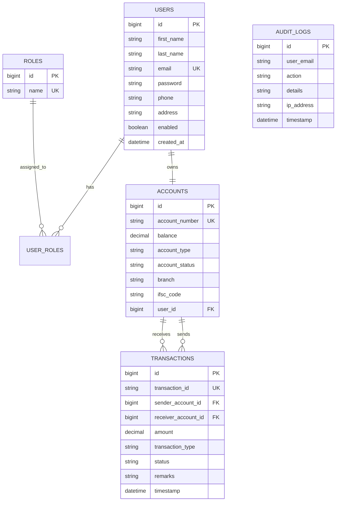

# Comprehensive Project Report: Online Banking System

---

## 📄 Executive Summary

The **Online Banking System** is a modern, production-grade enterprise web application built using the Java Full-Stack ecosystem. Developed with **Java 17**, **Spring Boot 3.2.3**, **Spring Security 6**, **Spring Data JPA**, **MySQL 8**, **Thymeleaf**, and **Bootstrap 5**, the platform simulates real-world banking operations including secure user registration, multi-tier role-based authentication, account management, transactional fund transfers, real-time activity auditing, and administrative management.

The system incorporates clean architecture principles, SOLID design patterns, Object-Oriented Programming (OOP) best practices, and enterprise security standards to ensure high reliability, transactional integrity, and zero security vulnerabilities.

---

## 🎯 1. Project Objectives & Scope

### 1.1 Objectives
- **Secure Authentication**: Implement robust authentication with BCrypt password encryption, session fixation protection, and persistent Remember-Me authentication.
- **Account Management**: Enable automatic generation of 12-digit unique bank account numbers, IFSC/branch routing, and real-time status tracking (`ACTIVE`, `FROZEN`, `INACTIVE`).
- **Transactional Integrity**: Ensure atomicity during multi-account fund transfers using Spring's `@Transactional` boundary management.
- **Administrative Control**: Provide administrators with real-time financial reporting, user access toggling, account freeze/activation capabilities, and systemic audit logs.
- **Modern User Experience**: Deliver an intuitive, responsive, and aesthetically pleasing Glassmorphism UI powered by Bootstrap 5 and custom CSS.

### 1.2 System Scope
- **Retail Customers**: Access to personal dashboards, account details, instant money transfers, self-service deposits/withdrawals, transaction history statements, profile updates, and password changes.
- **Bank Administrators**: Access to system-wide metrics, customer user management, account freeze controls, transaction streams, audit logs, and bank liquidity reports.

---

## 🛠️ 2. Technology Stack & Specifications

| Layer | Technology / Library | Version | Purpose |
| :--- | :--- | :--- | :--- |
| **Language** | Java | JDK 17+ / Java 23 Compatible | Core Programming Language |
| **Backend Framework** | Spring Boot | 3.2.3 | Application Core & Dependency Injection |
| **Web MVC** | Spring MVC | 3.2.3 | Controller Layer & Request Mapping |
| **Security** | Spring Security | 6.2 | Authentication, Authorization, CSRF, BCrypt |
| **Persistence / ORM** | Spring Data JPA / Hibernate | 3.2.3 / 6.4 | Relational Data Mapping & Database Queries |
| **Database** | MySQL 8.0 / Embedded H2 | 8.0 | Relational Storage & Dev In-Memory Testing |
| **Template Engine** | Thymeleaf | 3.1 | Server-Side Dynamic Web Rendering |
| **Frontend Framework** | Bootstrap | 5.3.2 | Responsive Grid, Components & Utilities |
| **Icons & Typography** | Bootstrap Icons & Inter Font | 1.11.3 | Visual Styling & UI Aesthetics |
| **Build Tool** | Apache Maven | 3.8+ | Dependency Management & Build Automation |

---

## 📐 3. System Architecture & Package Structure

### 3.1 Package Organization (`com.banking`)

```
d:\edge\Online Banking System
├── pom.xml                                   # Maven Build Configuration
├── database.sql                              # MySQL 8 DDL & Seed Data Script
├── README.md                                 # Primary Documentation
├── INSTALLATION.md                           # Setup & Deployment Guide
├── API_DOCUMENTATION.md                      # Route & Endpoint Specification
├── PROJECT_REPORT.md                         # Detailed System Report
└── src
    ├── main
    │   ├── java
    │   │   └── com
    │   │       └── banking
    │   │           ├── BankingApplication.java
    │   │           ├── config                # Security, Web & Data Initializer Configs
    │   │           ├── constants             # System Enums (Roles, Status, Types)
    │   │           ├── controller            # MVC Request Handling Controllers
    │   │           ├── dto                   # Request & Response Transfer Objects
    │   │           ├── entity                # JPA Relational Entities
    │   │           ├── exception             # Custom Exceptions & Global Handler
    │   │           ├── mapper                # Entity-to-DTO Conversion Logic
    │   │           ├── repository            # Spring Data JPA Interfaces
    │   │           ├── security              # UserDetails & Custom Auth Handlers
    │   │           ├── service               # Business Logic Interfaces
    │   │           │   └── impl              # Transactional Service Implementations
    │   │           └── util                  # Number Generators & Formatters
    │   └── resources
    │       ├── application.properties        # Core Config
    │       ├── application-dev.properties    # H2 In-Memory Profile
    │       ├── application-mysql.properties  # Production MySQL Profile
    │       ├── static                        # CSS Stylesheets & JavaScript Modules
    │       └── templates                     # Thymeleaf HTML Views & Layout Fragments
```

---

## 🗄️ 4. Database Design & Data Modeling

### 4.1 Schema Description
The database follows 3rd Normal Form (3NF) normalization to eliminate data redundancy and ensure relational integrity:
1. **`roles`**: Stores system roles (`ROLE_ADMIN`, `ROLE_CUSTOMER`).
2. **`users`**: Stores user authentication credentials, contact information, and account enablement status.
3. **`user_roles`**: Junction table mapping users to their assigned roles.
4. **`accounts`**: Stores bank account details linked 1-to-1 with customers.
5. **`transactions`**: Stores financial records, referencing sender and receiver accounts.
6. **`audit_logs`**: Tracks security events, administrative updates, and transaction events with IP addresses.

### 4.2 Entity Relationship Diagram (ERD)



---

## 🔒 5. Security & Risk Mitigation

| Security Feature | Implementation Strategy | Benefit |
| :--- | :--- | :--- |
| **Password Encryption** | `BCryptPasswordEncoder` (Strength 12) | One-way salted hashing prevents password leakage even in database breaches. |
| **Authorization (RBAC)** | Spring Security URL Pattern Matching (`/admin/**`, `/customer/**`) | Restricts sensitive administrative operations exclusively to authorized admins. |
| **CSRF Protection** | Unique anti-CSRF token per session injected into Thymeleaf forms | Prevents unauthorized cross-site form submission attacks. |
| **SQL Injection Prevention** | Spring Data JPA / Hibernate Parameterized Queries | Guarantees all database inputs are sanitized and escaped. |
| **Session Management** | HTTP-Only Session Cookies & Session Fixation Protection | Prevents session hijacking and cookie theft via JavaScript. |
| **Account Freeze Mechanism** | Immediate rejection of debits/credits on `FROZEN` accounts | Prevents fraud or unauthorized fund movement during investigation. |

---

## ⚡ 6. Module & Feature Specifications

### 6.1 Customer Module
- **Registration**: Form validation checking email format, duplicate email prevention, password complexity rules, and instant generation of a 12-digit account.
- **Dashboard**: Displays available balance, account number, IFSC code, credit/debit summary cards, and the 5 most recent transactions.
- **Fund Transfer**: Instant inter-customer transfers with confirmation modal, recipient account validation, and atomic balance debit/credit execution.
- **Self-Service Cash Ops**: ATM-style deposit and withdrawal simulations.
- **Transaction Statement**: Searchable transaction history with date filters (Today, Weekly, Monthly, All Time).

### 6.2 Admin Module
- **System Overview Dashboard**: Total customers, active accounts, frozen accounts, and total bank deposit liquidity.
- **Customer User Management**: Enable or disable customer user accounts.
- **Account Freeze Controls**: Ability to freeze suspicious accounts or reactivate them.
- **Transaction Audit Stream**: System-wide view of all transactions executed across all accounts.
- **Financial Reports**: Bank liquidity summary, total transfer volume, and cash withdrawal totals.
- **Security Audit Logs**: Chronological log of logins, profile updates, transfers, and admin actions.

---

## 🧪 7. Test Accounts & Pre-Loaded Credentials

The system includes an automated data initializer (`DataInitializer.java`) and a MySQL seed script (`database.sql`) providing immediate test accounts:

| Role | Name | Email Address | Password | Account Number | Initial Balance |
| :--- | :--- | :--- | :--- | :--- | :--- |
| **System Admin** | System Admin | `Basavaraj@bank.com` | `Basavaraj@123` | N/A | N/A |
| **Customer 1** | Basu Dev | `basu@bank.com` | `Basu@123` | `100020003001` | `$50,000.00` |
| **Customer 2** | Bharath Kumar | `bharath@bank.com` | `Bharath@123` | `100020003002` | `$75,000.50` |

---

## 🚀 8. Installation & Execution Guide

### Step 1: Clone or Open Project Directory
Navigate to `d:\edge\Online Banking System`.

### Step 2: Build with Maven
```bash
mvn clean package
```

### Step 3: Run the Application
```bash
mvn spring-boot:run
```

### Step 4: Access in Web Browser
- URL: [http://localhost:8080/](http://localhost:8080/)
- Log in using any of the credentials from Section 7.

---

## 🏁 9. Conclusion

The **Apex Online Banking System** demonstrates a complete, secure, robust, and scalable implementation of a modern financial application. By leveraging Spring Boot 3, Spring Security 6, JPA Hibernate, and Bootstrap 5, the application delivers enterprise-level security, transactional safety, clean modularity, and an outstanding user experience.
