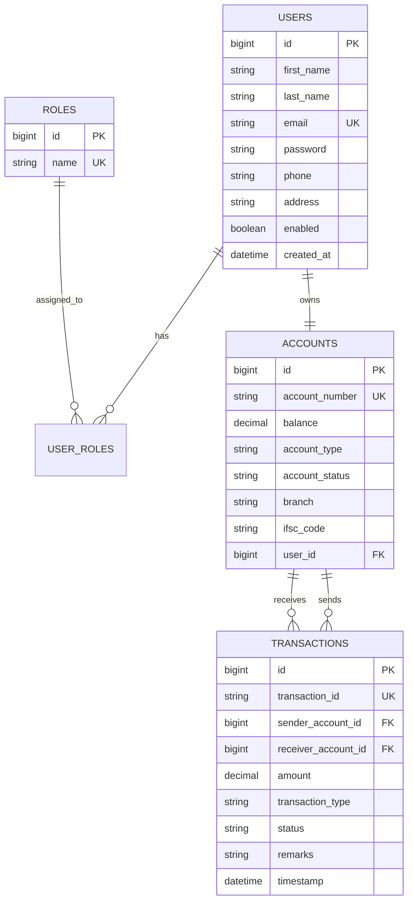
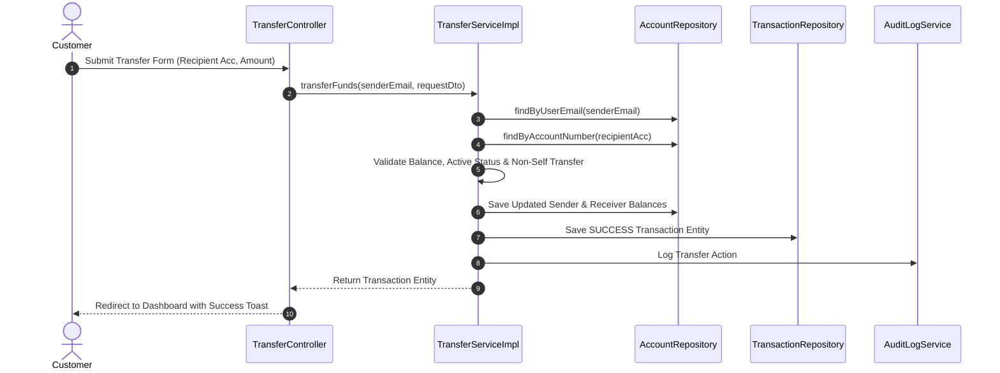

# Apex Online Banking System 🏦

A production-grade, full-stack **Online Banking System** developed with **Java 17**, **Spring Boot 3**, **Spring Security 6**, **Spring Data JPA**, **MySQL 8**, **Thymeleaf**, and **Bootstrap 5**.

---

## 🌟 Key Features

### 🔐 1. Authentication & Security
- **BCrypt Password Encoding** (Strength 12).
- **Spring Security 6 Architecture** with custom `UserDetailsService` and `AuthenticationSuccessHandler`.
- **Role-Based Access Control (RBAC)**:
  - `ROLE_ADMIN`: Access to user management, account freezing/activation, global transaction streams, financial reports, and audit logs.
  - `ROLE_CUSTOMER`: Access to personal banking dashboard, account details, fund transfers, self-service deposits/withdrawals, profile management, and password updates.
- **Session Protection** & **Remember-Me** persistent authentication.
- **CSRF Token Validation** on all state-mutating forms.

### 💳 2. Account Management
- Instant 12-digit account number generation (`1000...`) upon customer registration.
- Multiple account types (`SAVINGS`, `CURRENT`).
- Complete account status tracking (`ACTIVE`, `FROZEN`, `INACTIVE`).
- Admin controls to freeze or activate customer accounts in real-time.

### 💸 3. Fund Transfer & Transactions
- `@Transactional` multi-account funds transfer ensuring atomicity.
- Validation rules:
  - Checks receiver account existence.
  - Prevents self-transfers.
  - Enforces sufficient balance limits.
  - Blocks transfers if sender or receiver account is `FROZEN`.
- Real-time transaction history with date-range filters (All Time, Today, Weekly, Monthly) and Transaction ID search.

### 📊 4. Admin Management & Audit Logs
- Comprehensive financial KPI report cards (Total Deposits, Transfers Volume, Withdrawals Volume).
- Real-time audit log recording every login, registration, transfer, and administrative action.

---

## 🔑 Default Test Accounts & Credentials

| Role | Name | Email Address | Password | Default Account No |
| :--- | :--- | :--- | :--- | :--- |
| **Admin** | System Admin | `Basavaraj@bank.com` | `Basavaraj@123` | N/A |
| **Customer 1** | Basu Dev | `basu@bank.com` | `Basu@123` | `100020003001` |
| **Customer 2** | Bharath Kumar | `bharath@bank.com` | `Bharath@123` | `100020003002` |

---

## 🛠️ Technology Stack

- **Backend Framework**: Java 17, Spring Boot 3.2.3, Spring Security 6, Spring Data JPA (Hibernate)
- **Frontend Template Engine**: Thymeleaf with `thymeleaf-extras-springsecurity6`
- **UI & Styling**: Bootstrap 5.3, Bootstrap Icons, Custom Glassmorphism CSS
- **Database**: MySQL 8.0 / Embedded H2 Database
- **Build Tool**: Maven

---

## 📐 Architecture & Entity Diagrams

### Entity Relationship (ER) Diagram



### Transfer Sequence Diagram



---

## 📁 Package Structure

```
com.banking
├── BankingApplication.java
├── config
│   ├── CustomAuthenticationSuccessHandler.java
│   ├── DataInitializer.java
│   ├── SecurityConfig.java
│   └── WebConfig.java
├── constants
│   ├── AccountStatus.java
│   ├── AccountType.java
│   ├── RoleName.java
│   ├── TransactionStatus.java
│   └── TransactionType.java
├── controller
│   ├── AccountController.java
│   ├── AdminController.java
│   ├── CustomErrorController.java
│   ├── DashboardController.java
│   ├── HomeController.java
│   ├── LoginController.java
│   ├── RegistrationController.java
│   ├── TransactionController.java
│   └── TransferController.java
├── dto
│   ├── AccountDto.java
│   ├── AdminReportDto.java
│   ├── ChangePasswordDto.java
│   ├── DashboardSummaryDto.java
│   ├── DepositWithdrawDto.java
│   ├── EntityDtoMapper.java
│   ├── RegisterDto.java
│   ├── TransactionDto.java
│   ├── UserProfileDto.java
│   └── TransferRequestDto.java
├── entity
│   ├── Account.java
│   ├── AuditLog.java
│   ├── Role.java
│   ├── Transaction.java
│   └── User.java
├── exception
│   ├── AccountFrozenException.java
│   ├── AccountNotFoundException.java
│   ├── DuplicateEmailException.java
│   ├── GlobalExceptionHandler.java
│   ├── InsufficientBalanceException.java
│   └── InvalidTransactionException.java
├── repository
│   ├── AccountRepository.java
│   ├── AuditLogRepository.java
│   ├── RoleRepository.java
│   ├── TransactionRepository.java
│   └── UserRepository.java
├── security
│   ├── CustomUserDetails.java
│   ├── CustomUserDetailsService.java
│   └── SecurityUtils.java
├── service
│   ├── AccountService.java
│   ├── AdminService.java
│   ├── AuditLogService.java
│   ├── TransactionService.java
│   ├── TransferService.java
│   └── UserService.java
├── service.impl
│   ├── AccountServiceImpl.java
│   ├── AdminServiceImpl.java
│   ├── AuditLogServiceImpl.java
│   ├── TransactionServiceImpl.java
│   ├── TransferServiceImpl.java
│   └── UserServiceImpl.java
└── util
    ├── AccountNumberGenerator.java
    └── DateUtils.java
```

---

## 🚀 Getting Started

Please consult [INSTALLATION.md](file:///d:/edge/Online%20Banking%20System/INSTALLATION.md) for detailed step-by-step instructions on running the application locally using MySQL 8 or the embedded H2 database.
